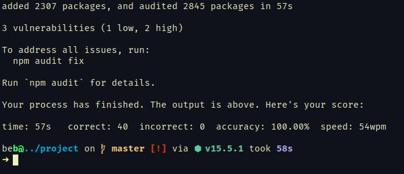

### ftyper
*Terminal typing practice.*


#### features
* Test your typing speed and accuracy
* Practice while you wait for your other command to finish
* Over 3000 most commonly used english words from the [New General Service List](https://www.newgeneralservicelist.org/) <sup>1</sup>
#### installation
###### Arch
````
$ git clone https://github.com/toppair/ftyper
$ cd ftyper
$ makepkg --install --clean
````
#### building from source
prerequisites:

* [Rustup](https://www.rust-lang.org/tools/install) (rustc, cargo)

````
$ git clone https://github.com/toppair/ftyper
$ cd ftyper
$ cargo build --release
````

#### usage
By default ftyper will run with a 60 seconds time limit. You can set your own limit by running the command like so:
````
$ ftyper -t 30
````
You can pass a command to run in background:
````
$ ftyper -c npm install
````
The test will last until child process finishes:



---
> Windows currently not supported

> Should probably work on OS X if you build from source
---
<sup>1</sup> The [New General Service List](https://www.newgeneralservicelist.org/) is licensed under a [Creative Commons Attribution-ShareAlike 4.0 International License](https://creativecommons.org/licenses/by-sa/4.0/)
